<div align="center">



# local-agent

**A streaming, tool-calling agent client that talks to any OpenAI-compatible endpoint.**

[](https://www.python.org/)
[](https://github.com/astral-sh/uv)

</div>

---

## What this is

A minimal agent loop. It streams tokens from a chat-completions endpoint, parses tool calls, executes them, and feeds the results back — until the model stops asking for tools and returns a final answer.

The client is provider-agnostic. It works against:

- A self-hosted vLLM/Ollama/llama.cpp server (the original target was NVIDIA Nemotron 3 Nano on vLLM — the server has since been split into its own repo and is hosted elsewhere).
- OpenAI's API.
- Anthropic's API (via an OpenAI-compatible shim).

## Features

- **Streaming token-by-token output** with live reasoning passthrough (the `<think>...</think>` blocks thinking models emit).
- **Tool calling** in the standard OpenAI tool-call format, with fragment reassembly across stream chunks.
- **Built-in tools** — calculator (AST-based, no `eval`), weather (wttr.in), file reader, file-tree viewer, current time. File tools are sandboxed to the project directory.
- **Safe by construction** — file tools reject paths outside the project root; the calculator walks the AST instead of evaluating it.

## Requirements

- Python 3.12
- [`uv`](https://github.com/astral-sh/uv) for dependency management
- An endpoint to talk to — either a remote provider (OpenAI / Anthropic) or a self-hosted OpenAI-compatible server

## Setup

```bash
# 1. Install dependencies
uv sync --group agent

# 2. Configure provider credentials (or point at a local server)
cp .env.example .env
# then edit .env — see "Configuring the endpoint" below
```

## Running

```bash
uv run python -m agent
```

You'll get a `>` prompt. Try:

```
> what's 2 ** 16 plus the number of files in agent/tools?
> what's the weather in new york right now?
> read agent/loop.py and explain how tool calls are reassembled across stream chunks
```

Type `exit` to quit.

## Configuring the endpoint

`agent/client.py` builds the OpenAI client. Three modes:

**Local / self-hosted** — pass `local=True` when constructing `Agent`. Hits `http://localhost:8000/v1` with model `nemotron3-nano-4b-fp8`. Edit `LOCAL_BASE_URL` in `agent/client.py` to point at a different host or port.

**Remote provider** — pass `model_provider='openai'` (or `'anthropic'`) and a `model` name. The client reads `OPENAI_API_KEY` / `OPENAI_API_URL` (or the `ANTHROPIC_*` equivalents) from `.env`.

`agent/__main__.py` is the default entry point and currently constructs `Agent` without `local=True`, so set the env vars before running, or edit `__main__.py` to pass `local=True` if you're pointing at a local server.

## Project layout

```
local-agent/
├── agent/
│   ├── __main__.py         # REPL entry point (uv run python -m agent)
│   ├── agent.py            # Agent class, message history, context wiring
│   ├── client.py           # OpenAI client builder (local / openai / anthropic)
│   ├── loop.py             # streaming execution loop, tool-call reassembly
│   ├── tool_handler.py     # tool registry + dispatch
│   ├── context/
│   │   ├── system_prompt.md
│   │   └── memory.md
│   └── tools/              # individual tools (one file each)
│       ├── calculator.py
│       ├── file_architecture.py
│       ├── read_file.py
│       └── weather.py
└── pyproject.toml
```

## How the loop works

`agent/loop.py` is the interesting part. The model's response can interleave plain text, reasoning, and tool-call fragments — the latter arrive in pieces keyed by index, with the function name on the first fragment and arguments dribbling in across many subsequent chunks. The loop:

1. Streams a completion, printing content live.
2. Reassembles fragmented `tool_calls` into complete dicts.
3. If there are tool calls, executes each one through `ToolHandler.call()` and appends the results as `role: "tool"` messages.
4. Repeats until the model returns a turn with no tool calls — that's the final answer.
5. Bails out at `max_iters=10` to avoid runaway loops.

Reasoning content is printed live but **not** appended to history, matching the convention for thinking models.

## Adding a tool

A tool is just a dict with four keys. Drop a file in `agent/tools/` like:

```python
# agent/tools/echo.py
def echo(text: str) -> str:
    return text

tool = {
    'name': 'echo',
    'description': 'Echo a string back unchanged.',
    'parameters': {
        'type': 'object',
        'properties': {
            'text': {'type': 'string', 'description': 'String to echo.'},
        },
        'required': ['text'],
    },
    'fn': echo,
}
```

Then register it in `agent/__main__.py`:

```python
from agent.tools import echo
agent = Agent(tools=[..., echo.tool])
```

The schema goes to the model on the next request, and `ToolHandler` dispatches to your `fn` when the model calls it.

## License

MIT (or whatever you prefer — add a `LICENSE` file).

## Acknowledgements

- [wttr.in](https://wttr.in) for the weather endpoint
